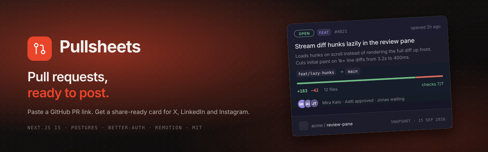
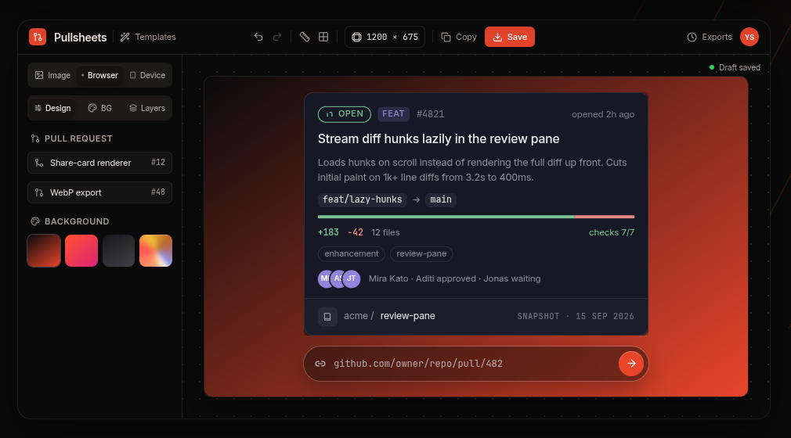
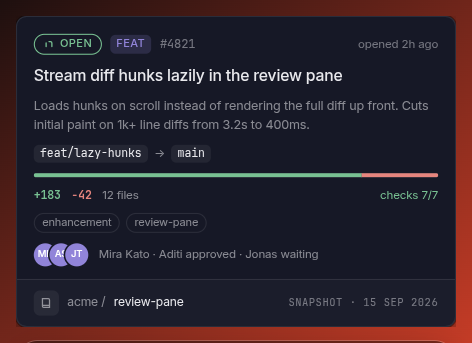
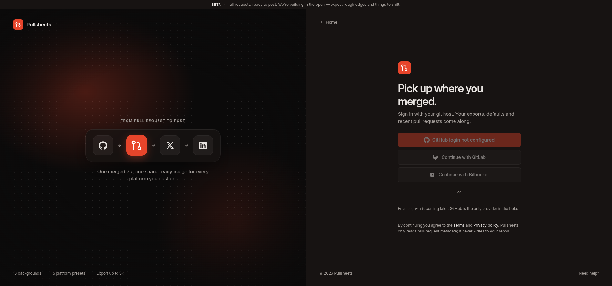

<p align="center">
  
</p>

<p align="center">
  <a href="LICENSE"></a>
  
  
  
  
  
</p>

<p align="center">
  Paste a GitHub pull-request link. Get a share-ready card for X, LinkedIn and Instagram.<br>
  <sub>Public repos work right away · Sign in with GitHub for private ones</sub>
</p>

---

<p align="center">
  
</p>

<table align="center">
  <tr>
    <td align="center" width="50%">
      <br>
      <sub><b>One information model, rendered as a card.</b> State, type, title, change, checks, reviewers, repo, snapshot — the nine facts of a pull request.</sub>
    </td>
    <td align="center" width="50%">
      <br>
      <sub><b>GitHub sign-in.</b> Tokens encrypted at rest; private PRs are always re-authorised against GitHub with <em>your</em> token.</sub>
    </td>
  </tr>
</table>

## What it does

1. **Import** — paste `github.com/owner/repo/pull/123`. Pullsheets fetches the PR, its reviews, files and check runs, and maps them to one `PrFacts` model. Results are cached with ETags so refreshes cost almost nothing against your rate limit.
2. **Design** — pick a card style and format, a browser or device frame, a background, 3D tilt, captions and overlays. Card styles span seven families — Midnight, Industrial, Modern, Minimal, Futuristic, Terminal and Editorial — each across six formats (Queue Row, Compact, Standard, Detail, Digest, Detail Wide). Undo/redo, platform presets for X, LinkedIn, Instagram and Stories.
3. **Export** — PNG/JPG at 1–5× straight from the browser. Video (MP4/GIF), server-side renders, billing and social posting are the next phases and the UI says so instead of pretending.

## Status

This is **phase 1 of 7 — Foundation**: the application runs end to end locally with real auth, a real database and real GitHub import. Everything below marked *phase N* is designed (see [the architecture spec](docs/superpowers/specs/2026-10-02-pullsheets-architecture-design.md)) but not built yet.

| Area | Phase 1 | Next |
|---|---|---|
| GitHub sign-in (better-auth), encrypted tokens, protected routes | ✅ | — |
| PR import with ETag + TTL cache, typed errors, private-PR revalidation | ✅ | Redis-backed limiter when multi-instance (phase 7) |
| Card library: `PrFacts` model, 8 states, 8 type chips, Midnight · Standard | ✅ | ✅ 6 formats × 7 families |
| Editor: server page, reducer with history, panels, live import, PNG export | ✅ | — |
| Account: session-backed, connected GitHub, recent PRs, sign-out | ✅ | settings persistence (phase 3) |
| Storage + server-side `renderStill` for paywalled exports | — | phase 3 |
| Video via Remotion (local / Lambda) | — | phase 4 |
| Billing via Stripe, webhooks with idempotency | — | phase 5 |
| Post to X / LinkedIn | — | phase 6 |
| Public API, rate limiting, observability, CI, Playwright | — | phase 7 |

## Quick start

Requirements: **Node ≥ 20**, **pnpm**, **Docker**.

```bash
git clone https://github.com/yashksaini-coder/PullSheets.git && cd PullSheets
pnpm install
cp .env.example .env.local
# Tier 0 — generate two secrets:   openssl rand -base64 32   (BETTER_AUTH_SECRET, TOKEN_ENCRYPTION_KEY)
# Tier 1 — a GitHub OAuth App:     Homepage http://localhost:3000
#                                  Callback http://localhost:3000/api/auth/callback/github
docker compose up -d --wait        # Postgres 16; --wait blocks until it reports healthy
pnpm db:migrate
pnpm dev                           # http://localhost:3000
```

Without Tier 1 the app still boots: the landing page and public-PR import work, and the sign-in button explains which variables are missing.

<details>
<summary><b>Verify your setup</b> — the phase-1 acceptance checklist (needs GitHub OAuth credentials)</summary>

The maintainers could not exercise sign-in during the phase-1 build — there were no GitHub OAuth credentials on the build machine. If you have real credentials in `.env.local`, walk this once after `pnpm dev` is up:

1. Sign in with GitHub from `/login`.
2. `/account` shows your GitHub handle as the connected account.
3. Paste a PR URL into the editor's import field.
4. The card on the canvas updates with that PR's facts.
5. Click **Save PNG**.
6. The export appears in Recent exports (`/account`).
7. Click a row in "Recent pull requests" on `/account` — the editor opens with that PR imported.
8. Paste a **private** PR you can access — the card renders. Then open the same `/api/pr?url=…` in a logged-out tab: it must answer **404**, never the cached facts.
9. Paste a PR you cannot access — the editor says "Pull request not found".
10. Hit Refresh on an imported PR — devtools shows `x-pr-cache: miss` on the `/api/pr` response.
11. Sign out — you land on `/`, and `/editor` redirects to `/login?next=…`.
12. `docker exec pullsheets-db psql -U pullsheets -c '\dt'` lists the **12** application tables. `__drizzle_migrations` lives in the `drizzle` schema: `docker exec pullsheets-db psql -U pullsheets -c "\dt drizzle.*"`.

</details>

## Environment

Configuration is **tiered**. Tier 0 must be set or the server refuses to start, naming the variable. Every other tier is optional: when its variables are absent, the feature is disabled in the UI and its API routes answer `503 feature_unconfigured` — never a fake success. The flags are *derived* from variable presence in [`lib/env.ts`](lib/env.ts); there are no hand-written `*_ENABLED` switches to drift out of sync. Every variable is documented in [`.env.example`](.env.example).

| Tier | Variables | Enables | Status |
|---|---|---|---|
| 0 | `DATABASE_URL` `BETTER_AUTH_SECRET` `BETTER_AUTH_URL` `TOKEN_ENCRYPTION_KEY` | boot | ✅ |
| 1 | `GITHUB_CLIENT_ID` `GITHUB_CLIENT_SECRET` `GITHUB_PUBLIC_TOKEN` | GitHub login, private PR import, higher public rate limit | ✅ |
| 2 | `STORAGE_DRIVER` + `S3_*` / `BLOB_READ_WRITE_TOKEN` | export history, server renders | phase 3 |
| 3 | `VIDEO_RENDER_MODE` + `REMOTION_*` | video (local / Lambda) | phase 4 |
| 4 | `STRIPE_*` | billing | phase 5 |
| 5 | `X_*` `LINKEDIN_*` | social posting | phase 6 |

Notes worth knowing before you deploy anything:

- `.env.local` is git-ignored and never leaves your machine. On first run, `pnpm db:migrate` must follow `docker compose up -d --wait` so the schema exists before the app boots.
- **Rotating `BETTER_AUTH_SECRET` invalidates every stored GitHub token.** better-auth encrypts the OAuth tokens in `accounts` with a key derived from that secret, so after a rotation every user signs in again. `TOKEN_ENCRYPTION_KEY` is reserved for the phase-6 `social_connections` tokens and has no runtime consumer yet; it is validated at boot so the key exists before that phase.

## How it works

A few decisions that shape the codebase — the full reasoning is in the [architecture spec](docs/superpowers/specs/2026-10-02-pullsheets-architecture-design.md).

**The card library is pure.** Nothing under [`components/cards/`](components/cards) may import `next/*` or touch `window`, `document`, `localStorage` or `fetch` — an ESLint rule enforces it. Props in, JSX out. That is what lets the same components render in the browser for instant export *and* in Node under Remotion for video and paywalled high-resolution stills, without a monorepo.

**GitHub is the authoriser for private PRs.** `pr_cache` is keyed by `(repo, number)`, so a cached private PR could leak to anyone who guesses the URL. Rows flagged `is_private` therefore never short-circuit on TTL: every request revalidates with the *caller's* token via a conditional GET. GitHub answers `304` to someone allowed to see it and `404` to everyone else, and the route maps both honestly.

**Errors are typed at the boundary.** Route handlers are wrapped in `withRoute()`; GitHub failures map to `404 pr_not_found`, `403 pr_forbidden`, `429 rate_limited { resetAt }`, `403 github_token_invalid` or a generic `502` — and anything unexpected is logged server-side and returned as a bare `500`, never a stack.

**One schema for the editor state.** `Design` is a zod schema shared by the editor reducer (bounded 50-step undo history), the URL codec, and — in phase 4 — Remotion's input props. The browser preview and the server render cannot drift because they parse the same object.

## Project layout

```
app/                 routes (server pages) and /api route handlers
components/
  cards/             the PR card library — pure React, lint-enforced (model, primitives, layouts, families, registry)
  editor/            editor shell, provider + reducer, panels, canvas, frames, CardScaler
  account/           account shell, recent PRs
  auth/              sign-in / sign-out
  ui.tsx             primitives (Button, Segmented, Slider, Dialog, Toaster, …)
lib/
  env.ts             tiered env + derived `features`
  db/                Drizzle schema + client          drizzle/   generated migrations
  auth/              better-auth server + client, session helpers, safe redirect
  github/            octokit client, PrFacts mapper, ETag/TTL cache, recent PRs
  editor/            Design schema + URL codec
  crypto.ts          AES-256-GCM helpers (phase-6 tokens)
  errors.ts          AppError hierarchy + withRoute
styles/tokens/       design tokens (plain CSS — no Tailwind)
docs/
  superpowers/       architecture spec and per-phase implementation plans
  design/            PR Cards design library, distilled from the original prototype
  assets/            README images
```

## Scripts

| Command | What it does |
|---|---|
| `pnpm dev` / `build` / `start` | Next.js dev server / production build / serve |
| `pnpm typecheck` · `lint` · `format` · `format:check` | `tsc --noEmit` · ESLint · Prettier |
| `pnpm test` · `test:watch` | Vitest (node + jsdom) |
| `pnpm db:generate` · `db:migrate` · `db:push` · `db:studio` | Drizzle Kit: generate a migration · apply · push schema · browse |

## Known limitations

- **Anonymous `/api/pr` is limited to 30 requests per 10 minutes per client IP** by an in-process token bucket (state resets on deploy; move to Redis before scaling out). `pr_cache` rows older than 7 days are swept opportunistically.
- Private PRs are never served from the cache TTL; importing one costs a (conditional) GitHub call every time.
- Video export, server-side renders, billing and social posting are phases 3–6; their controls say so rather than pretending.
- Card truncation for very long branch names and paths is CSS-only and verified in the browser, not in the test suite.
- **Deployment notes:** the anonymous `/api/pr` rate limit trusts the **last** `x-forwarded-for` hop — the one appended by your single trusted proxy (Vercel, Cloudflare, nginx `real_ip`). A direct-exposed deploy is bypassable with a spoofed header and needs a proxy in front of it; more than one proxy layer needs a hop-count knob (phase 7).

## Roadmap

| Phase | Delivers |
|---|---|
| **1 · Foundation** ✅ | env, Postgres, auth, GitHub import, card model + Midnight, editor refactor, account |
| **2 · Card library** ✅ | 6 formats × 7 families (Midnight, Industrial, Modern, Minimal, Futuristic, Terminal, Editorial), self-hosted fonts, per-IP `/api/pr` limiter + cache sweep |
| 3 · Export | storage drivers, server-side `renderStill`, export history in Postgres, entitlements |
| 4 · Video | Remotion compositions for 8 clips, local + Lambda, render jobs with progress |
| 5 · Billing | Stripe Checkout + Portal, webhook idempotency, plan gating |
| 6 · Social | X and LinkedIn OAuth, post an export |
| 7 · Hardening | public API with keys, rate limiting, logging, Playwright, CI |

## Contributing

Issues and PRs are welcome. The [PR template](.github/PULL_REQUEST_TEMPLATE.md) is the checklist: gates green (`pnpm typecheck && pnpm lint && pnpm test && pnpm build`), new env vars in `.env.example`, schema changes with a migration, and nothing under `components/cards/` importing Next or browser APIs.

## License

[MIT](LICENSE) © 2026 Yash Saini
